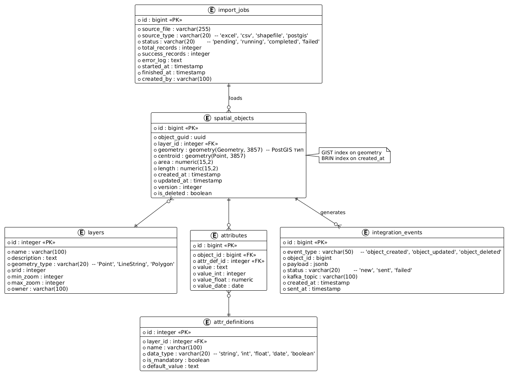

# Кейс 1: Геоинформационная система (ГИС) — интеграции, ETL, пространственные данные

## Контекст
Компания **Гортис АТИ** (системная интеграция, автоматизация технологических процессов) разрабатывала геоинформационную систему для управления объектами инфраструктуры.  
Моя задача — обеспечить загрузку пространственных и атрибутивных данных из разнородных источников (Excel, CSV, внешние БД), наладить интеграции через REST API и очереди (Kafka, RabbitMQ), а также оптимизировать SQL-запросы.

## Моя роль
Системный аналитик: сбор требований, проектирование API-контрактов, ETL-процессов, моделирование данных (ER-диаграммы), написание сложных SQL-запросов.

## Что сделано

### 1. Моделирование данных (ER-диаграмма)
Спроектирована база данных PostgreSQL для хранения:
- Пространственных объектов (точки, линии, полигоны) с использованием PostGIS
- Атрибутивной информации (слои, классификаторы, метаданные)
- Журналов загрузки и версионирования

См. `models/er_diagram_gis.puml`

### ER-диаграмма базы данных ГИС

### 2. ETL-процессы
- Разработан Python-скрипт для извлечения данных из Excel/CSV, очистки (координаты, коды ОКАТО) и загрузки в PostgreSQL
- Настроена валидация геометрии (проверка на вылеты за границы, самопересечения)
- Реализована дедупликация объектов по уникальным идентификаторам

См. `python_etl/etl_gis_load.py` и `sql_etl/geometry_validation.sql`

### 3. API и асинхронные интеграции
- Спроектирован REST API (OpenAPI) для внешних систем: создание, обновление, удаление объектов, получение по геометрии
- Настроены очереди Kafka/RabbitMQ для событий изменения данных (обновление слоя, добавление объекта)
- Примеры producer/consumer — в папке `kafka_example/`

См. `api_specs/openapi_gis.yaml`

### 4. Сложные SQL-запросы
- Оконные функции для поиска дублей геометрий
- Пространственные запросы (расстояние, пересечение, буфер)
- Агрегация статистики по слоям

См. `sql_etl/advanced_queries.sql`

## Результаты
- Загружено **1000+ объектов** в ГИС, сокращение времени подготовки данных на **35%**
- Устранены ключевые противоречия в исходной информации → снижение количества инцидентов со стороны бизнеса на **50%**
- Время ответа API на пространственный запрос — менее 500 мс для 10 000 объектов

## Артефакты в папке
- `models/er_diagram_gis.puml` — ER-диаграмма БД с пространственными расширениями
- `api_specs/openapi_gis.yaml` — спецификация REST API
- `sql_etl/geometry_validation.sql` — проверка корректности геометрии
- `sql_etl/advanced_queries.sql` — сложные запросы (оконные функции, пространственные)
- `python_etl/etl_gis_load.py` — ETL-скрипт на Python
- `kafka_example/` — примеры producer/consumer для событий ГИС
